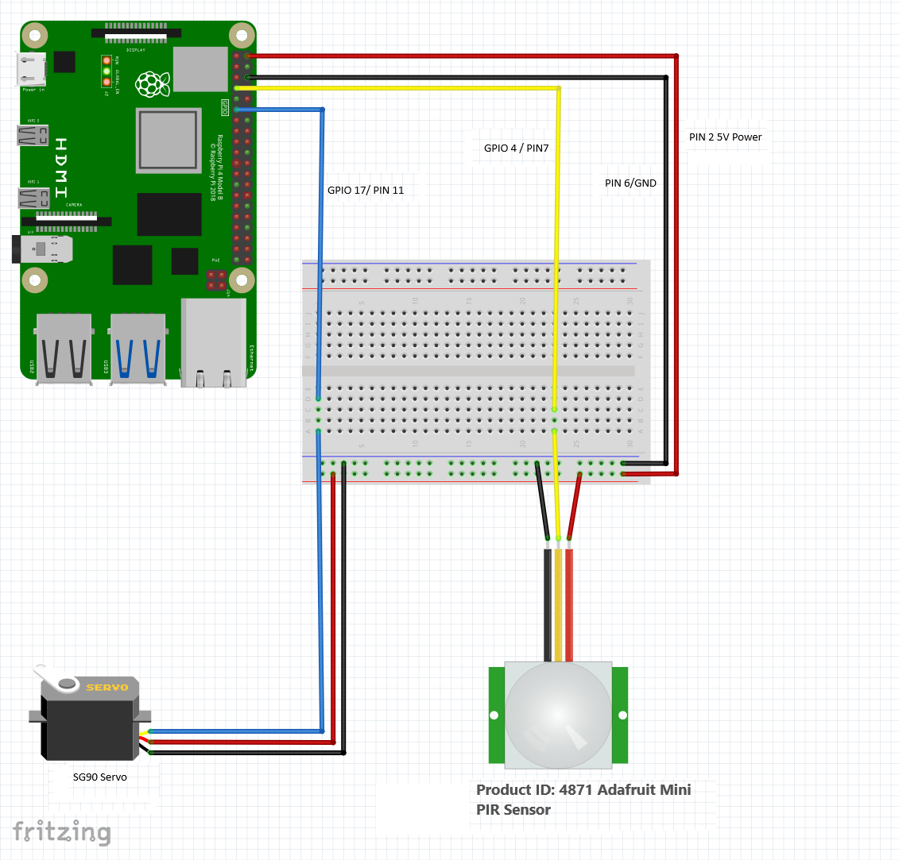
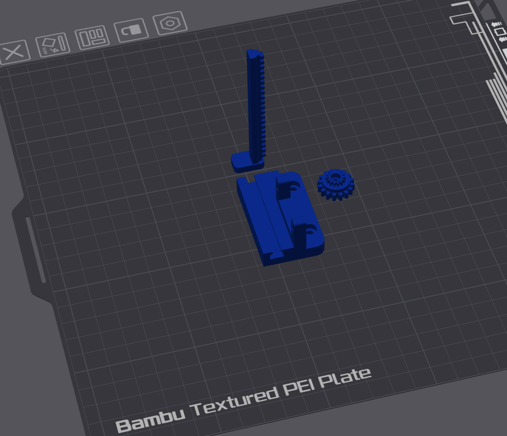
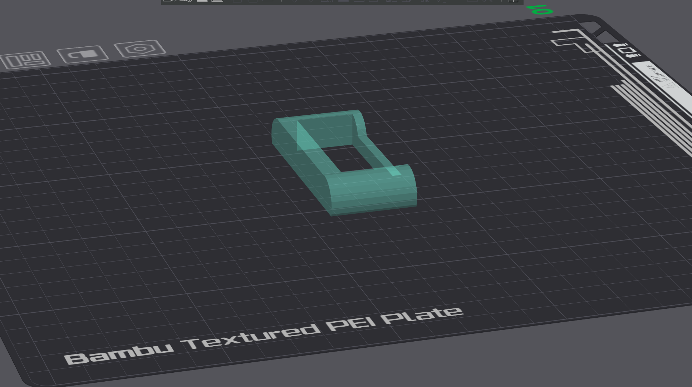

# Pet Feeding Automation System

This repository contains a Raspberry Pi-based automated pet feeding and containment system.

## Project Overview

This is a Raspberry Pi-based automated pet feeding and containment system that controls a servo motor for door mechanisms and smart feeders for pets named Trixie and Pickles. The system uses PIR motion sensors to detect pet presence and automate feeding sequences.

## Architecture

The codebase consists of standalone Python scripts that work together to create an automated pet management system:

### Core Components

- **Servo Control Scripts**: `120.py`, `90.py`, `close.py`, `open.py` - Control servo motor for door mechanism
  - Door servo (GPIO 17): Controls entry/exit door
- **Sensor Monitoring**: `check_entry.py` - Main control loop monitoring PIR sensors
- **Feeder Control**: `myfeeder2.py` - Controls smart feeders via TinyTuya cloud API

### Hardware Integration

- **GPIO Pins**:
  - Pin 17: Door servo motor
  - Pin 4: PIR motion sensor
- **External APIs**: TinyTuya cloud service for smart feeder control

#### GPIO Pin Layout


#### Servo Housing and Actuator


#### Door Hasp Mechanism


### Control Flow

1. `check_entry.py` monitors PIR sensor for pet presence
2. When triggered, executes `120.py` to close door servo
3. Continues monitoring PIR sensor for pet presence in containment area
4. Triggers feeding sequence via `myfeeder2.py` for both pets
5. Opens door after delay using `open.py`

## Development Environment

- **Python Version**: 3.11 (virtual environment at `.venv/`)
- **Key Dependencies**: 
  - `RPi.GPIO` - Raspberry Pi GPIO control
  - `tinytuya` - Smart device cloud API
  - `python-dotenv` - Environment variable management

## Running Scripts

### Individual Servo Control
```bash
python 120.py     # Close door servo
python 90.py      # Alternative close (different angle)
python close.py   # Close door servo
python open.py    # Open door servo
```

### Main System
```bash
python check_entry.py  # Start main monitoring loop
```

### Manual Feeding
```bash
/home/metalo/src/.venv/bin/python myfeeder2.py trixie 3   # Feed Trixie 3 portions
/home/metalo/src/.venv/bin/python myfeeder2.py pickles 3 # Feed Pickles 3 portions
```

## File Dependencies

All scripts now use local file paths within the repository directory structure.

## Security Configuration

### Environment Variables Setup

1. **Install python-dotenv**: `pip install python-dotenv`
2. **Copy environment template**: `cp .env.example .env`
3. **Configure credentials** in `.env` with your actual TinyTuya API credentials:
   - `TINYTUYA_API_KEY` - Your TinyTuya API key
   - `TINYTUYA_API_SECRET` - Your TinyTuya API secret
   - `PICKLES_DEVICE_ID` - Device ID for Pickles' feeder
   - `TRIXIE_DEVICE_ID` - Device ID for Trixie's feeder

### Security Best Practices

- **Never commit `.env` file** - It's excluded in `.gitignore`
- **Use `.env.example`** for sharing configuration structure
- **Rotate API credentials** regularly
- **Restrict API permissions** to minimum required scope
- **Monitor API usage** for unauthorized access

### Files Containing Credentials

- `.env` - Contains actual secrets (never commit)
- `.env.example` - Template showing required variables (safe to commit)
- `myfeeder2.py` - Uses environment variables via `os.getenv()`

## Hardware Requirements

- Raspberry Pi with GPIO access
- One servo motor connected to pin 17
- PIR motion sensor on pin 4
- Network connectivity for TinyTuya API calls